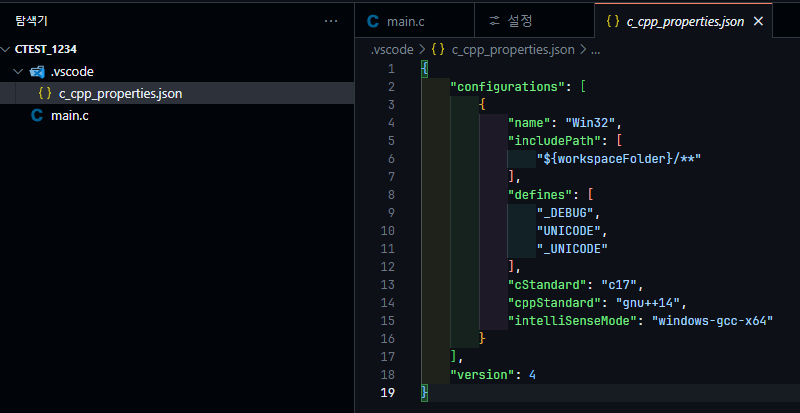

# vscode_atoz
VSCode C언어 개발 환경을 세팅해보자😊 따라하면 됩니다.

## 1. MinGW64 설치
https://sourceforge.net/projects/mingw/files/

### 환경 변수 설정
시스템 변수의 `Path` 에 `C:\MinGW\bin` 을 넣는다.
하실 수 있을거라고 믿습니다.

### 확인
`g++ --version` 을 CMD에 입력해서 Path 및 MinGW가 정상적으로 설정, 설치가 되었는지 확인한다.

## 2. VSCode 설치
공식 홈페이지에서 설치한다.
VSCode로 열기 메뉴를 추가하기 위해서 체크를 꼭 하고 넘어간다.
안해도 괜찮지만 귀찮음.

VSCode를 실행하면 이런 모양이 나온다.
폴더를 열어서 Source 폴더를 선택한다.
> 작업영역을 신뢰하냐고 하면 신뢰한다고 한다.

### C언어 Intellisense 세팅
C언어 문법검사 및 함수 링크 등등 그런 것들을 설정해줘야 한다.
   
`c/c++` 을 
여기서 검색해서 다운로드를 받는다.

#### C/C++ 세팅
너무 내용이 기므로   
기존에 메일로 송부드린 C/C++ Intellisense 를 참고 부탁드립니다.

### Source 열기

탭에서 맨위에서 폴더열기를 클릭한다. 또는 아래 메뉴에서 들어갈 수 있다.

>SourceInsight는 프로젝트 처럼 관리되지만 VSCode는 그냥 폴더를 여는 개념이다. 프로젝트 그런 것이 따로 없다.

#### VSCode 갑분팁
`alt + shift + h` 를 누르면 호출 관계를 찾을 수 있다!

> 마우스 오른쪽 클릭후 메뉴를 클릭해도 된다.

   
`모든 참조 찾기`, `호출 계증 구조 표시`  '

##### 검색할 때... 특정 파일 제외 및 포함 시키는 방법

저기에 원하는 파일 형식 또는 이름을 넣으면 된다. 
> 예로들어, *.c, *.h 를 넣으면 c와 h 파일만 검색되고 제외할 파일에 *.json, *.ts 를 넣으면 저런 파일은 검색에서 제외된다.

특정 단어 위주로 포함되는 함수를 찾을 경우, 정규식을 활용해야한다.   
EncodePacket_MSG_TYPE_Function 을 찾고싶을 경우

`.*`

> 이런게 있네욥?

아니면 상단 검색창에 `#EEPROM` 이런식으로 검색하셔도 됩니다.

### 세팅의 개념
- user 세팅(님 세팅)   
    모든 프로젝트에 공통으로 적용되는 설정
    VSCode를 설치한 후 모든 프로젝트에서 동일하게 적용되는 환경을 설정할 때 사용
    예: 테마, 글꼴 크기, 기본 키 바인딩 등.
- 이 폴더에 들어간 세팅 (작업공간 Workspace Settings)    
    특정 프로젝트(폴더)에만 적용되는 설정
    프로젝트별로 다른 설정이 필요할 때 사용
    예: 빌드 명령어, 디버그 설정, 특정 확장 기능의 설정 등.

이 두가지로 나뉩니다.

#### user Settings

이렇게 폰트 등을 수정할 수 있습니다.

프로젝트 컴파일러 설정등은 작업 영역에서 하는 것이 적절합니다.

##### 자동 저장
   
자동저장 같은거는 개인적인 것이니, user settings에 하는 것이 적절합니다.
   
600ms 뒤에 저장되는 세팅입니다.

#### 작업영역(Workspace) Settings
    
c/c++ 구성편집을 하면 

`.vscode` 폴더에서 c_cpp_properties.json 이 생성 됩니다. 이 세팅은 작업영역에만 종속적이므로 다른 곳을 열면 적용되지 않습니다.
그래서, 다른 프로젝트를 열 때 이 VSCode를 복사해서 넣고 새로 설정해주는게 마음 편합니다. (e.g. Include Directory 등) 아니면, 그냥 누가 git에 올려두고 아무도 건드리지 않으면 됩니다.

만약에 자동저장 Delay를 누가 작업영역에서
   
10003 으로 저장했다면
   
`.vscode` 안에 10003으로 Json 값 세팅이 됩니다.

그렇다면, user와 workspace 중 똑같은 설정에 대해 다른 값이 있다면 어떻게 될까요?   
workspace 세팅이 더 우선순위가 높습니다.
